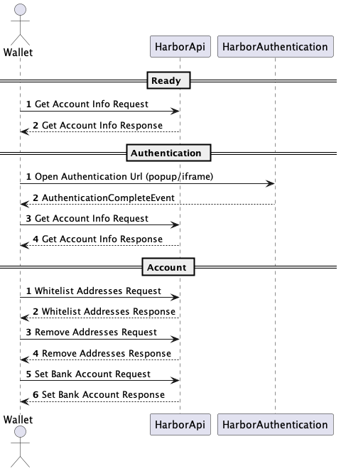

# harbour-ts-sdk

## Flow Diagram


## Usage of SDK

1. Copy `src/index.ts` and `src/gen/**` to you project
2. Look into example of usage below or in the `examples/example.ts`

## Example
Example of SDK initialization and usage
```Typscript
import {Wallet} from 'ethers';
import crypto from 'crypto';

import Ramp from '.'
import {GetAccountInfoRequest, Ecosystem, SignatureType, WhitelistAddressRequest} from "./gen/ramp/v1/public_pb";

const privateKey = "0x"+crypto.randomBytes(32).toString('hex');
const wallet = new Wallet(privateKey);

const ramp = new Ramp(
  "https://...",
  SignatureType.SECP256K1,
  wallet.signingKey.publicKey,
  wallet.signMessage
)

const accountInfo = await ramp.getAccountInfo(new GetAccountInfoRequest())

await ramp.whitelistAddress(
  new WhitelistAddressRequest({
    protocol: Protocol.ETHEREUM,
    address: wallet.address,
    publicKey: wallet.signingKey.compressedPublicKey,
    name: "My Wallet 1",
    addressSignature: await wallet.signMessage(wallet.address),
  }),
);
```

Use following endpoints:
- TBD
